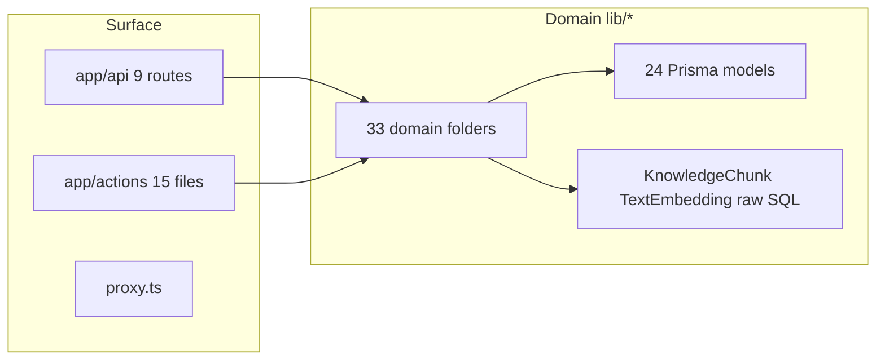
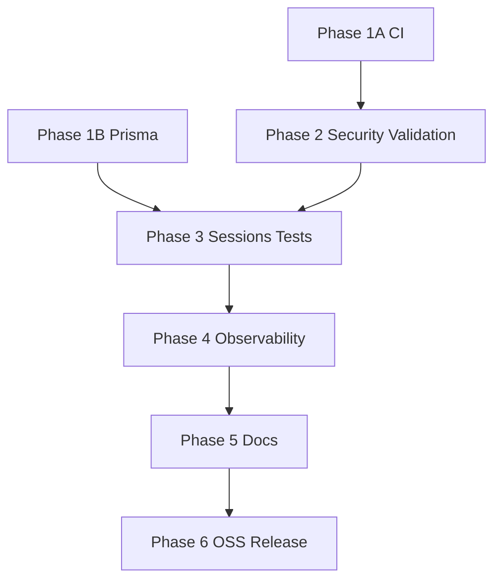

# Backend Completion — Full Execution Plan

## User intent (2026-06-18)

Implement **all three** execution tracks from the readiness handoff, plus **additional gaps** discovered against open-source and production backend standards:

| Track | What | Why |
|-------|------|-----|
| **Track 1** | Full backend hardening (Phases 1–5 below) | OSS contributors + frontend contract stability |
| **Track 2** | Integration connectivity & validation | E2E showed OpenRouter 401; backend must detect/report bad keys |
| **Track 3** | Source-available release hygiene | Custom LICENSE (personal free / commercial royalty), SECURITY.md, push CI, dependency governance |

**Not in scope (frontend / desktop / master-plan deferred):** P1 nav collapse, embedded wizard, warm LinkedIn live reader, Pipecat runner, cooperative Playwright handoff UI.

---

## Architecture (unchanged)

---

## Additional gaps discovered (beyond original plan)

These were **not** in the first draft but are required for OSS / production backend standards:

| ID | Gap | Evidence | Phase |
|----|-----|----------|-------|
| **OSS-01** | No `LICENSE` file | Glob: 0 LICENSE in repo root | 6 |
| **OSS-02** | `package.json` `"private": true` | Set `false` + custom license reference for public repo | 6 |
| **OSS-04** | Custom license required | Personal free for all; Solomon S Joseph commercial exception; third-party commercial requires royalty | 6 |
| **OSS-03** | No Dependabot / security policy | No `.github/dependabot.yml` | 6 |
| **VAL-01** | Zod in deps, **unused in server actions** | `grep zod app/actions` → 0 | 2 |
| **VAL-02** | No integration **verify/probe** endpoint | OpenRouter 401 undetected until LLM call fails | 2 |
| **TEST-01** | 18 orphan `scripts/test-*.ts` sub-gates not in CI | review_backend_report | 1 |
| **SEC-18** | No rate limiting on API routes | LAN exposure without throttling | 2 |
| **SEC-17** | LLM prompt injection via job descriptions | security_red_team deferred | 4 |
| **OPS-01** | No startup warning when token unset + non-loopback bind | README only | 4 |
| **OPS-02** | `/api/health` missing readiness for DB + integrations | — | 4 |
| **AUTH-01** | `loadDreamCompaniesAction` missing `requireAccessForRead()` | dream-companies.ts L12 | 2 |
| **GIT-01** | Unpushed commits on `main` | assess run readiness report | 6 |

---

## Phase 1 — CI & Schema Foundation

**Parallel:** Track 1A ∥ Track 1B (no file overlap)

### 1A — CI Postgres + quality gates

**Files:** [`.github/workflows/ci.yml`](.github/workflows/ci.yml)

- Add `services.postgres` (pgvector/pg17), `DATABASE_URL`, `prisma migrate deploy`
- Add `npm run lint`
- Add `npm audit --audit-level=high` (document allowlist for known moderate advisories if needed)
- Optional: wire 5–10 highest-value orphan sub-gates (track-classify, apply-router, interview-guard) as npm scripts

**Commit:** `ci: add postgres service, lint, and audit gates`

### 1B — Prisma models for vector tables

**Files:** [`prisma/schema.prisma`](prisma/schema.prisma), [`lib/knowledge/index.ts`](lib/knowledge/index.ts), [`lib/scoring/embedding-relevance.ts`](lib/scoring/embedding-relevance.ts)

- Add `KnowledgeChunk` + `TextEmbedding` models with `profileId` FK → `Profile`
- Migration from existing raw tables; remove runtime `CREATE TABLE IF NOT EXISTS` where redundant
- Extend [`scripts/test-knowledge.ts`](scripts/test-knowledge.ts) with DB index/retrieve integration (skip if no DB)

**Commit:** `feat(db): promote KnowledgeChunk and TextEmbedding to Prisma models`

---

## Phase 2 — Security, Validation & Integration Connectivity

**Parallel:** 2A auth ∥ 2B validation ∥ 2C proxy tests (after 2A file audit)

### 2A — Auth gaps

**Files:** [`app/actions/dream-companies.ts`](app/actions/dream-companies.ts), [`lib/auth/access.ts`](lib/auth/access.ts), [`app/api/backup/export/route.ts`](app/api/backup/export/route.ts)

- Gate `loadDreamCompaniesAction` with `requireAccessForRead()`
- Full audit: grep all `"use server"` exports for missing gates
- Deprecate `?token=` — warn in logs; update error messages to Bearer/cookie only
- Backup export: default-deny on non-loopback even when token unset

**Commit:** `fix(security): close read gates and harden backup export`

### 2B — Input validation + integration verify (Track 2 core)

**Files:** new [`lib/validation/action-schemas.ts`](lib/validation/action-schemas.ts), [`app/api/integrations/verify/route.ts`](app/api/integrations/verify/route.ts), high-risk actions (integrations, profiles, apply, backup)

- Add Zod schemas for mutating server action inputs (IDs, enums, bounded strings, file size refs)
- **`POST /api/integrations/verify`** — probe configured integrations without returning secrets:
  - OpenRouter: minimal models list or auth check → `{ openrouter: "ok"|"invalid"|"missing" }`
  - JSearch, ElevenLabs: optional lightweight ping when keys present
- Extend [`app/api/integrations/status/route.ts`](app/api/integrations/status/route.ts) or health to surface last verify result (cached 5 min)

**Commit:** `feat(api): add Zod action validation and integration verify endpoint`

### 2C — Proxy + rate limit

**Files:** [`proxy.ts`](proxy.ts), new [`lib/security/rate-limit.ts`](lib/security/rate-limit.ts), [`scripts/test-security.ts`](scripts/test-security.ts)

- Extract testable auth helpers; add proxy integration tests (Host, Bearer, cookie)
- Simple in-memory rate limit on protected API prefixes (100 req/min/IP) for LAN deployments
- Gmail push: optional Pub/Sub OIDC when `GMAIL_PUSH_VERIFY_OIDC=1`

**Commits (split):**
1. `test(security): add proxy LAN auth integration tests`
2. `feat(security): rate limit protected API routes on LAN`

---

## Phase 3 — Durable State & Integration Tests

**Sequential:** 3A then 3B (shared schema)

### 3A — Persist apply sessions

**Files:** [`lib/apply/session-service.ts`](lib/apply/session-service.ts), [`prisma/schema.prisma`](prisma/schema.prisma), [`app/api/apply/session/[id]/route.ts`](app/api/apply/session/[id]/route.ts)

- New `ApplySession` model; replace in-memory `Map`
- TTL/cleanup on read (optional cron via catchup)

**Commit:** `feat(apply): persist cooperative sessions to Postgres`

### 3B — Autopilot + knowledge E2E tests

**Files:** [`scripts/test-autopilot.ts`](scripts/test-autopilot.ts), [`scripts/test-knowledge.ts`](scripts/test-knowledge.ts)

- `runAutopilotCycle` against fixtures + DB; assert `briefed > 0`
- Knowledge full index → retrieve round-trip with profile isolation

**Commit:** `test: add DB-integrated autopilot and knowledge tests`

---

## Phase 4 — Observability & Hardening

**Parallel:** 4A observability ∥ 4B LLM injection guard

### 4A — Observability baseline

**Files:** new [`app/api/health/route.ts`](app/api/health/route.ts), [`lib/observability/logger.ts`](lib/observability/logger.ts), [`lib/observability/audit.ts`](lib/observability/audit.ts), [`instrumentation.ts`](instrumentation.ts)

- `/api/health` → `{ status, db, integrations, version }`
- Structured JSON logger (requestId, domain, level)
- Audit events: `integration.secret.saved`, `backup.export`, `profile.deleted` (metadata only, no values)
- Startup log warning if `JOB_OS_ACCESS_TOKEN` unset (document only; no block on localhost)

**Commit:** `feat(ops): add health endpoint, structured logging, and audit events`

### 4B — LLM input sanitization (SEC-17)

**Files:** [`lib/apply/fields-llm.ts`](lib/apply/fields-llm.ts), [`lib/brief/compose.ts`](lib/brief/compose.ts), [`lib/resume/tailor.ts`](lib/resume/tailor.ts)

- Strip/control delimiter injection patterns in job description → LLM prompts
- Extend provenance tags for LLM-derived apply fields

**Commit:** `fix(security): harden LLM prompts against delimiter injection`

---

## Phase 5 — API Contracts & Documentation

**Files:** new [`docs/backend-api.md`](docs/backend-api.md), [`docs/ARCHITECTURE.md`](docs/ARCHITECTURE.md), [`docs/DEPLOYMENT.md`](docs/DEPLOYMENT.md), [`README.md`](README.md)

- Document all 9 API routes + 15 server action files (inputs, outputs, auth, errors)
- Architecture: domain map, adapter seams, fixture vs live matrix
- Deployment: Docker, env checklist, LAN security, FileVault/.secrets

**Commit:** `docs: add backend API contracts and deployment guide`

---

## Phase 6 — Source-Available Release Hygiene (Track 3)

**Files:** `LICENSE`, `SECURITY.md`, `CONTRIBUTING.md`, [`.github/dependabot.yml`](.github/dependabot.yml), [`package.json`](package.json)

### Custom license (user-specified)

**Not OSI open source.** Public repo with source-visible license:

| Party / use | Allowed |
|-------------|---------|
| **Anyone — personal / non-commercial** | Free |
| **Solomon S Joseph** (GitHub `solomonsjoseph`, repo owner) | **Free for all uses including commercial** — explicit named exception |
| **All other parties — commercial** | **Prohibited without royalty agreement** — must cease use or contact owner for royalty terms |

Draft `LICENSE` with clear sections: Grant (personal), **Named commercial exception** (Solomon S Joseph / `solomonsjoseph`), Commercial restriction (third parties), Royalty contact, Disclaimer, Limitation of liability. Add `COMMERCIAL-LICENSE.md` for third-party commercial licensing inquiries.

**Copyright / sole owner:** Solomon S Joseph (repo owner, all rights reserved)  
**Commercial royalty contact (third parties):** brucebanner010198@gmail.com  
**Repository maintainer access:** GitHub `solomonsjoseph` — sole explicit full-access maintainer (enforce via `.github/CODEOWNERS`)

- README license section: link to LICENSE + commercial terms
- SECURITY.md — threat model from [`security_red_team_assessment.md`](.cursor/plans/security_red_team_assessment.md)
- CONTRIBUTING.md — CI, tests, commit conventions; note CLA not required for personal contributions but commercial fork restrictions apply
- Dependabot: npm weekly, GitHub Actions
- Set `"private": false`, `"license": "SEE LICENSE IN LICENSE"`

**Commits (split):**
1. `chore(license): add personal-use LICENSE and commercial terms`
2. `chore: add SECURITY.md and CONTRIBUTING.md`
3. `chore(ci): add Dependabot configuration`
4. `chore: prepare package.json for public repository`

**Push:** after full CI green locally and user confirms remote

---

## Execution order & parallelism

| Step | Tracks in parallel | Commits expected |
|------|-------------------|------------------|
| 1 | 1A + 1B | 2 |
| 2 | 2A, then 2B + 2C | 3–4 |
| 3 | 3A → 3B | 2 |
| 4 | 4A + 4B | 2 |
| 5 | 5 | 1 |
| 6 | 6 | 3 + push |

**Total: ~13–15 commits**

---

## Definition of done (backend complete for frontend)

- [ ] CI green on GitHub with Postgres (all 37+ tests)
- [ ] Prisma owns vector/knowledge tables
- [ ] Apply sessions durable
- [ ] All server actions gated + Zod-validated (mutations)
- [ ] `/api/health` + `/api/integrations/verify` operational
- [ ] `docs/backend-api.md` complete
- [ ] Custom LICENSE (personal free / commercial royalty) + SECURITY.md + CONTRIBUTING.md present
- [ ] Commits pushed; Dependabot enabled

---

## Trade-offs (documented, not blocking)

| Enterprise standard | Job OS choice |
|---------------------|---------------|
| OIDC/RBAC | Shared bearer token + loopback trust |
| Always-live adapters | Fixture fallbacks by design |
| OpenTelemetry | Structured logger + health (OTel optional later) |
| Warm LinkedIn scraper | Desktop seam; manual CSV import |

---

## Frontend handoff

After Phase 5: frontend may treat server action signatures as stable; use `/api/health` and integration verify for setup UX; show `liveStatus` badges from [`lib/modules.ts`](lib/modules.ts) for partial/fixture modules.

---

## Execution status

**COMPLETE** — 2026-06-18. HEAD `8dd29f4` (17 commits ahead of origin). Local CI 47/47 green ([Final CI verification](7ce1cc02-1fa2-422f-b402-59378b745a76)). Push pending user approval.

### Summary of all three tracks + extras

| # | Track | Phases | Key deliverables |
|---|-------|--------|------------------|
| 1 | Backend hardening | 1–5 | CI+Postgres, Prisma vector models, auth/Zod/rate-limit, durable sessions, health/audit, API docs |
| 2 | Integration connectivity | 2B, 4A | `/api/integrations/verify`, OpenRouter probe, health integration status |
| 3 | Release hygiene | 6 | Custom LICENSE, SECURITY.md, Dependabot, push to origin |
| + | Discovered gaps | 2, 4 | Zod validation, orphan tests in CI, LLM injection guard, dream-companies auth |
