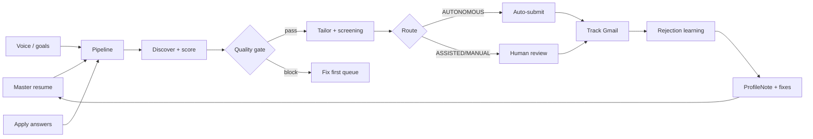

# Product Vision: Hire Probability & Dual-Audience Optimization

**Status:** active  
**Updated:** 2026-06-18  
**Repo:** `/Users/sj1136/Documents/06_Software_And_Code/Personal/Job_OS`

---

## North star

Job OS transforms job seekers into candidates who **consistently earn interviews** and have **higher hire probability** than peers — while **reducing HR burden** through scannable, decision-ready materials.

### North star metrics

| Metric | Definition | Target direction |
|--------|------------|------------------|
| **Interview rate** | `INTERVIEWING` or `OFFER` / `APPLIED` (confirmed) per 30-day window | ↑ vs baseline before Job OS |
| **Apply quality score** | Composite: job score × screening score × export gate | ↑; block apply when below threshold |
| **Time saved** | Minutes from discovery → tailored packet vs manual baseline | ↓ human time; ↑ automated prep |
| **Rejection learnings captured** | ProfileNotes tagged `rejection-learning` with actionable fixes | ↑ over time; feed master profile |

---

## Clarifications (locked assumptions)

| Topic | Assumption |
|-------|------------|
| **HR side** | Optimize applicant *outputs for* recruiters — not a separate employer ATS portal |
| **Volume** | Capped by quality scores + daily auto-apply limit; **AUTONOMOUS-only** unattended submit |
| **Top companies** | F500 screening standards already encoded in `lib/resume/ats-rules.ts` + `screening-score.ts` |
| **Spray-and-pray** | Explicitly rejected — quality gate blocks low-probability applies |

---

## Why candidates fail (research synthesis)

Sources: [Haired 10k-CV study (2025)](https://www.haired.app/blog/10000-cvs-ats-errors-study), [Resumefast 5k analysis](https://www.resumefast.io/blog/ats-failure-analysis-5000-resumes), [CVCraft ATS formatting tests (2026)](https://cvcraft.roynex.com/blog/can-ats-read-tables-columns-formatting-2026), TheLadders eye-tracking (6–7s skim), Careerflow/JobLabs recruiter scan research.

| Failure layer | What happens | Rate / impact |
|---------------|--------------|---------------|
| **ATS parse** | Tables, columns, headers/footers, graphics scramble or drop content | ~34–73% of resumes affected |
| **ATS keyword score** | Lexical JD match &lt;40% → deprioritized in recruiter search | ~58% of resumes; 6× gap vs 70%+ match |
| **Human 6s skim** | Recruiter scans name, title, employer, dates, education — binary pass | ~6–8 seconds to advance/reject |
| **Skim content** | No metrics in top fold, headline ≠ target role, wall-of-text bullets | ~3.2× callback gap for quantified bullets |
| **Role fit** | Seniority, location, visa, degree mismatches | Hard-gate caps in scoring |
| **Generic materials** | Untailored resume/cover for specific JD | Low keyword + weak skim |
| **Apply errors** | Wrong answers, CAPTCHA walls, MANUAL surfaces | Knockouts + route policy |
| **Slow follow-up** | No tracking; rejections not fed back to profile | Lost learning loop |

Interview invitation rates collapsed from ~15% (2016) to ~3% (2024) as application volume automated — making **quality per apply** the lever, not raw volume.

---

## Failure mode catalog

| ID | Cause | Detection | System fix | Owner module |
|----|-------|-----------|------------|--------------|
| `fm-ats-format` | Tables/columns/graphics break parsers | `ats-rules` format flags | Single-column HTML export | `lib/resume/` |
| `fm-ats-keywords-low` | JD keyword match below pass band | `screening-score`, `computeAtsMatch` | Re-tailor; gap panel on job card | `lib/resume/tailor.ts`, `lib/scoring/ats-keywords.ts` |
| `fm-skim-headline` | Headline doesn't signal target role | `skim-headline-match` rule | Tailor prompt + headline alignment | `lib/resume/tailor.ts` |
| `fm-skim-metrics` | Top-fold lacks quantified bullets | `metricsInTopFold` | `applySkimLayout` reorder | `lib/resume/skim-layout.ts` |
| `fm-role-fit` | Semantic/seniority mismatch | Job score + hard gate | Goals filter; quality gate job floor | `lib/scoring/` |
| `fm-apply-route` | CAPTCHA/login/MANUAL surface | Apply detection + route preview | Stop at REVIEW | `lib/apply/` |
| `fm-apply-answers` | Sponsorship/salary/auth knockout | Apply knockouts; rejection signals | ApplicationAnswers pre-fill | `lib/apply/` |
| `fm-volume-spray` | Low-quality bulk apply | Quality gate + daily cap | AUTONOMOUS-only auto-submit | `lib/autopilot/quality-gate.ts` |
| `fm-slow-followup` | No tracking / no learning | Stale APPLIED; empty intel | Gmail proposals + rejection-learning | `lib/track/` |
| `fm-generic-materials` | Untailored packet | Cover standards; keyword gap | Per-target tailor + cover | `lib/resume/`, `lib/coverletter/` |

Registry: `lib/candidate/failure-modes.ts`

---

## Applicant journey (3 inputs → automated pipeline)

### Three human inputs (once)

1. **Master resume** — voice/import → ProfileEntry facts
2. **Career goals** — north star, titles, constraints
3. **Application answers** — work auth, salary, links

### Automated pipeline

1. Discover → dedupe/ghost/scam screen → relevance + reachability score
2. Quality gate (`evaluateQualityGate`) — job score, screening/keyword floor, daily cap
3. Company brief → tailor resume + cover → screening score + skim layout
4. Apply readiness badge on job card — "Ready to apply" / "Fix first"
5. Submit: AUTONOMOUS auto; ASSISTED/MANUAL human gate
6. Gmail track → rejection learning → ProfileNote with failure-mode fixes

---

## HR packet spec (6-second skim)

What a recruiter sees in the first pass — implemented in `components/resume/recruiter-skim-view.tsx` + `lib/resume/recruiter-summary.ts`:

| Zone | Content | Time budget |
|------|---------|-------------|
| **Line 1 — Fit** | Name · headline aligned to target role · company | ~2s |
| **Line 2 — Proof** | Strongest quantified bullet (%, $, x) | ~2s |
| **Line 3 — Signal** | ATS % · skim score · top matched skills | ~2s |
| **Visual** | Top-third green highlight on skim HTML | F-pattern scan |

**Decision signal:** `interviewLikelihood` = strong | moderate | weak from `exportRecommended` + overall screening.

**Binary recruiter question:** "Does this person clearly fit this role enough to interview?" — answered in one screen, not a 3-page dossier.

---

## Quality + volume policy

| Control | Default | Env override |
|---------|---------|--------------|
| Min job score | 0.55 | `QUALITY_GATE_MIN_JOB_SCORE` |
| Min screening score | 65 | `QUALITY_GATE_MIN_SCREENING` |
| Min keyword match (proxy) | 70% | `QUALITY_GATE_MIN_KEYWORD_MATCH` |
| Max daily auto-applies | 5 | `QUALITY_GATE_MAX_DAILY_AUTO` |
| Auto-submit routes | AUTONOMOUS only | locked in `lib/autopilot/policy.ts` |

### Ethics

- Never auto-submit ASSISTED or MANUAL routes
- Never auto-submit below quality thresholds
- Daily cap prevents spray-and-pray even on clean routes
- Rejection learning is advisory — human confirms status moves
- Provenance gate blocks export of invented claims

Implementation: `lib/autopilot/quality-gate.ts`, `lib/candidate/apply-readiness.ts`

---

## Core loops

### Failure → Fix

Rejection email / low ATS / weak bullets / missing keywords / apply errors → `failure-modes.ts` maps signal → remediation → ProfileNote → future tailor.

### Quality gate → Volume

Only apply when screening + job score pass thresholds. AUTONOMOUS for clean routes; ASSISTED when human needed.

### Candidate transformation

Profile polish → tailor → screening score → apply → track → learn → feed master profile.

---

## Shipped in this pass (2026-06-18)

| Feature | Path |
|---------|------|
| Quality gate | `lib/autopilot/quality-gate.ts` |
| Failure registry | `lib/candidate/failure-modes.ts` |
| Apply readiness | `lib/candidate/apply-readiness.ts` + `components/jobs/apply-readiness-badge.tsx` |
| Recruiter packet UI | `components/resume/recruiter-skim-view.tsx` |
| HR one-pager | `lib/resume/recruiter-summary.ts` |
| Outcome loop | `lib/track/rejection-learning.ts` → failure modes + profile fixes |
| Autopilot wiring | `lib/autopilot/orchestrator.ts` quality gate before auto-submit |
| Tests | `scripts/test-hire-probability.ts` |

---

## Related docs

- [Master execution plan](./job_os_master_execution_plan.md) §17
- [Swarm ATS report](./swarm_ats_screening_report.md)
- [UX consolidation](./ux_flow_consolidation_plan.md)
- [Competitive landscape](./competitive_landscape_research.md)
