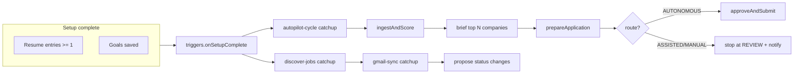

# Job OS — UX Flow Consolidation Plan

Planning-only document. No UI implementation in this session. Implementation agents should follow backlog IDs in master plan **§15**.

---

## 1. Current system audit

### 1.1 Navigation and shell

**Source:** `components/app-shell.tsx` — flat sidebar, **16 nav items**, no pipeline grouping:

| Nav item | Route | Module id |
|----------|-------|-----------|
| Dashboard | `/` | (module grid) |
| Master Resume | `/master-resume` | master-resume |
| Tailor Resume | `/resume` | resume / cover-letter |
| Career Goals | `/goals` | goals |
| Job Engine | `/jobs` | jobs |
| Company Brief | `/companies` | company-brief |
| Apply Engine | `/apply` | apply |
| Tracker | `/track` | tracker |
| Warm-Path | `/warm-path` | warm-path |
| Boosters | `/boosters` | boosters |
| Interview Prep | `/interview` | interview |
| LinkedIn | `/linkedin` | linkedin |
| Outcomes | `/outcomes` | outcomes |
| Integrations | `/integrations` | integrations |
| Backups | `/backups` | backups |
| Import | `/import` | import |

**Not in nav:** `/onboarding` (exists but orphaned — no layout redirect, no shell link).

**Dashboard (`app/(app)/page.tsx`):** Module grid (16 cards) + KPI strip + autopilot badge. Reads as *feature catalog*, not *pipeline in progress*.

### 1.2 Module registry (`lib/modules.ts`)

All modules `uiStatus: ready`; live adapters mostly `partial` (jobs, brief, apply, tracker, interview) or `fixture` (warm-path, linkedin). Phases 1–11 span the registry — UI presents equal-weight modules rather than funnel stages.

### 1.3 Domain modules (built behavior)

| Domain | Key paths | What works today |
|--------|-----------|------------------|
| **Master resume** | `lib/profile/`, `app/(app)/master-resume/`, `components/master-resume/dictation-panel.tsx` | ProfileEntry CRUD, voice/type dictation → LLM organize (`saveDictationAction`), bullet polish. **No file upload** on master-resume page itself. |
| **Import** | `app/(app)/import/`, `components/import/import-form.tsx` | Paste text → structured profile. PDF/DOCX deferred (`p7-import-resume`). Separate route from master-resume. |
| **Goals** | `lib/goals/`, `components/goals/goals-workspace.tsx` | `suggestGoalQuestions` + `synthesizeGoals` (OpenRouter). `VoiceInput` for free-text; form editor for milestones. Not a conversational voice agent. |
| **Jobs / discovery** | `lib/jobs/`, `app/(app)/jobs/`, `components/jobs/jobs-queue.tsx` | Multi-source ingest, screen, score, ranked queue. Manual "Discover" button. **No route tags on job cards.** |
| **Brief** | `lib/brief/`, `app/(app)/companies/` | Cited company briefs; manual company pick. Not auto-triggered per queued job in UI. |
| **Apply** | `lib/apply/`, `components/apply/apply-workspace.tsx` | Router: AUTONOMOUS / ASSISTED / MANUAL (`lib/apply/router.ts`). Route badges **only in apply workspace**. Review gate, Playwright driver opt-in, cooperative handoff states (PAUSED/HANDOFF) partially wired. |
| **Autopilot** | `lib/autopilot/orchestrator.ts`, `lib/scheduler/types.ts` | `runAutopilotCycle`: discover → index knowledge → prepare → auto-submit AUTONOMOUS. **Comment says "brief" but code does not call brief service** — gap vs master plan Phase 6 acceptance. Catchup job `autopilot-cycle` registered. |
| **Track / Gmail** | `lib/track/`, `lib/gmail/`, `app/(app)/track/` | Kanban (`BOARD_COLUMNS`: Warm path → To apply → Applied → Interviewing → Offer; REJECTED off-board). Gmail classifies → `proposeStatusChange` → human confirm (`requiresConfirm` for INTERVIEWING/OFFER/REJECTED). |
| **Interview** | `lib/interview/`, `components/interview/interview-board.tsx` | STUDY (extractive, offline) + AI_SCREEN + REAL_HR voice tabs per prep. **No prerequisite gate** before voice modes. Brief not surfaced inline. |
| **Onboarding** | `app/(app)/onboarding/page.tsx` | 4 link-out cards (resume, goals, apply answers, integrations) — not a wizard, not 3-step, not in nav. |

### 1.4 Locked master-plan constraints (must preserve)

| Constraint | Implication for UX |
|------------|-------------------|
| AUTONOMOUS-only auto-submit | Pipeline must show ASSISTED/MANUAL as "needs you" — not hide behind autopilot |
| Gmail propose-only | Interview/Rejected moves always show confirm UI; no "auto-moved" copy |
| Cooperative apply handoff (Phase 5) | ASSISTED path needs in-flow workspace, not a separate orphan page long-term |
| Integrations portal | Keys can stay in Setup stage but not counted as one of user's "3 inputs" |
| Local-first / human approves | Dashboard tagline already aligned — consolidate, don't remove gates |

---

## 2. Current flow vs desired flow

Step-by-step comparison. **Current** = what a user does today across scattered pages. **Target** = user vision.

| # | Stage | Current flow (steps) | Target flow | Gap |
|---|-------|---------------------|-------------|-----|
| **Setup** |
| 1 | Resume ingest | Find Import in nav (or skip) → paste text → optionally open Master Resume | Upload master resume (file or paste) | Upload on master-resume; import orphaned; onboarding doesn't include import |
| 2 | Resume update | Master Resume → dictate/type → Add to master resume | Voice dictation update | **Built** — browser `VoiceInput` + Wispr tip; not upload-then-dictate in one screen |
| 3 | Career goals | Goals → optional questions → speak/type → synthesize → edit form → save | Voice/conversation goals | **Partial** — LLM Q&A + synthesize, not multi-turn voice conversation |
| 4 | App answers | Onboarding step 3 → Apply page → fill locations, salary, custom answers | (Implicit in automation / one-time confirm) | Extra human step; should fold into Setup confirm or first ASSISTED apply |
| 5 | Integrations | Onboarding step 4 or Integrations nav | Background / settings (not a "input") | Correct content, wrong prominence |
| **Discover** |
| 6 | Job discovery | Jobs → click Discover → review queue | Automatic after goals complete | Autopilot + catchup exist; no UI "searching" stage; manual discover still primary |
| 7 | Scoring / filter | Inline in Jobs queue (expand row) | Automatic, explainable | **Built** — keep score explainability |
| 8 | Company brief | Separate Companies page, manual company | Auto-brief top jobs during autopilot | Brief module live; not in orchestrator code path |
| **Apply** |
| 9 | Tailor materials | Resume page per job (manual) | Auto during prepare | Tailor exists; triggered from apply prepare, not visible in pipeline |
| 10 | Route decision | Hidden until Apply workspace | Tags visible on cards: AUTONOMOUS / AI-ASSISTED | Tags only in `apply-workspace.tsx` |
| 11 | Submit | Apply workspace → Prepare → Review → Approve (ASSISTED) or auto (AUTONOMOUS) | AUTONOMOUS auto; ASSISTED cooperative handoff | Autopilot + review gate **built**; handoff UI partial |
| 12 | Post-apply | Tracker kanban Applied column | "Applied" section in pipeline | Same data, different IA |
| **Track** |
| 13 | Gmail sync | Track → connect Gmail → sync | Automatic read | Sync + classify **built** |
| 14 | Interview invite | Inbox proposals → confirm → Interviewing column | Selected → Interview stage | **Built** with human confirm |
| 15 | Rejection | Confirm REJECTED on proposal | Capture intel → improve future apps | Classify + propose **only** — **no learning loop** |
| **Interview** |
| 16 | Prerequisites | User must know to visit Companies + Interview Study | Questionnaire + brief + study **before** voice | Study **built**; brief separate; no questionnaire; **no gate** |
| 17 | AI screener | Interview → pick AI_SCREEN tab → start | Progressive: screener then HR | Modes exist as tabs, not enforced sequence |
| 18 | HR mock | Interview → REAL_HR tab | After screener stage | Same — no progression lock |
| **Outcome** |
| 19 | Offers / rejections | Tracker columns + Outcomes metrics | Outcome stage | Data exists; fragmented across Track + Outcomes |

**Step count (happy path, human actions):**

| | Current (minimum) | Target |
|---|-----------------|--------|
| Setup | 8–12 actions across 4–6 pages | 3 inputs |
| Per job apply (AUTONOMOUS) | 3–5 (find job, prepare, maybe discover) | 0 |
| Per job apply (ASSISTED) | 5–8 | 1 confirm (+ optional handoff) |
| Gmail status | 1 confirm per email | 1 confirm (unchanged) |
| Interview prep | 4+ (brief, study, voice ×2) | 1 checklist then 2 voice sessions |

---

## 3. Gap analysis (built vs missing)

| Capability | Status | Notes |
|------------|--------|-------|
| Master resume + dictation | **Built** | `DictationPanel`, `VoiceInput` |
| Resume file upload | **Missing** | `p7-import-resume`; import is paste-only |
| Conversational goals (voice agent) | **Missing** | Form + one-shot synthesize only |
| 3-step onboarding wizard | **Missing** | 4-card link hub; not in nav |
| Single pipeline UI | **Missing** | 16 nav items + module dashboard |
| Auto discovery after goals | **Partial** | `autopilot-cycle` + `discoveryQueryForUser`; needs setup-complete trigger + UI |
| Route tags on job cards | **Missing** | Only in apply workspace |
| AUTONOMOUS auto-submit | **Built** | Policy + orchestrator |
| ASSISTED cooperative handoff | **Partial** | State machine + actions; UI in apply-workspace |
| Gmail propose-only | **Built** | `proposeStatusChange`, `requiresConfirm` |
| Rejection learning loop | **Missing** | No `lib/track/rejection-learning.ts`; metrics count rejections only |
| Brief auto for queue | **Partial** | Service exists; orchestrator doesn't call it |
| Questionnaires before interview | **Missing** | No model or UI |
| Interview prerequisite gate | **Missing** | All modes available immediately |
| Progressive interview stages | **Missing** | Tabs, not funnel |
| Applied as pipeline section | **Partial** | Kanban column exists; not named in nav IA |

---

## 4. Proposed information architecture

Replace flat 16-item nav with **6 pipeline stages** + **Settings drawer** (progressive disclosure for power features).

```
[Setup] → [Searching] → [Applying] → [Applied] → [Interview] → [Outcome]
                                                              ↘ Settings: Integrations, Backups, LinkedIn, Warm-path, Boosters, Outcomes detail
```

| Stage | Route (proposed) | Absorbs current routes | Primary question answered |
|-------|------------------|------------------------|---------------------------|
| **Setup** | `/pipeline/setup` | `/onboarding`, `/import`, `/master-resume`, `/goals`, one-time apply answers | "Am I ready for autopilot?" |
| **Searching** | `/pipeline/searching` | `/jobs` (discover queue) | "What's coming in?" |
| **Applying** | `/pipeline/applying` | `/jobs` (actionable), `/apply`, `/companies` (inline brief) | "What needs me vs runs itself?" |
| **Applied** | `/pipeline/applied` | `/track` Applied column + inbox proposals (apply receipts) | "What's in flight?" |
| **Interview** | `/pipeline/interview` | `/interview`, brief snippet, study, voice | "Am I ready for the call?" |
| **Outcome** | `/pipeline/outcome` | `/track` Offer/Rejected + `/outcomes` | "How am I doing?" |

**Redirects:** Legacy routes (`/jobs`, `/apply`, etc.) remain as deep links; shell nav shows pipeline stages only. Module dashboard demoted to "Advanced" link inside Setup or removed after migration.

**Autopilot indicator:** Persistent slim banner on Searching/Applying/Applied — "Autopilot on · last run … · N awaiting review" (data from `autopilotStatus()` + apply REVIEW count).

---

## 5. Screen mock descriptions (text wireframes)

### 5.1 Setup (`/pipeline/setup`)

```
┌─────────────────────────────────────────────────────────────┐
│ Setup                                    Step 2 of 3  ●○○  │
├─────────────────────────────────────────────────────────────┤
│ [1 Resume]  [2 Update]  [3 Goals]          (stepper tabs)    │
│                                                             │
│ ┌─ Step 1: Your resume ─────────────────────────────────┐ │
│ │ [Upload PDF/DOCX]  or  [Paste text]                     │ │
│ │ Preview: 12 entries imported                            │ │
│ │                              [Continue →]               │ │
│ └─────────────────────────────────────────────────────────┘ │
│                                                             │
│ (Step 2: single dictation panel — reuse DictationPanel)     │
│ (Step 3: conversational goals — reuse GoalsWorkspace        │
│          condensed; voice-first; milestones collapsed)      │
│                                                             │
│ ── Ready check ───────────────────────────────────────────  │
│ ✓ Resume  ✓ Goals  ○ Integrations (optional)  [Start autopilot]│
└─────────────────────────────────────────────────────────────┘
```

- Progressive disclosure: integrations linked as optional "Power up" accordion, not step 4.
- Application answers: inline modal on first ASSISTED job or collapsible "Application defaults" on Setup step 3 footer.

### 5.2 Searching (`/pipeline/searching`)

```
┌─────────────────────────────────────────────────────────────┐
│ Searching                    Autopilot ●  ·  47 new · 12 kept │
├─────────────────────────────────────────────────────────────┤
│ Filtered out (3) ▾          │  Ranked queue                  │
│                             │  ┌──────────────────────────┐  │
│                             │  │ Acme · Sr Eng    92%  ⚡ Auto│  │
│                             │  │ Nova · Staff     88%  👁 Assist│ │
│                             │  └──────────────────────────┘  │
│                             │  (reuse JobsQueue + route badge) │
└─────────────────────────────────────────────────────────────┘
```

- Manual Discover demoted to "Refresh now" icon; autopilot drives default.
- Route badge preview: compute `routeApplication` preview from job surface (read-only) before prepare.

### 5.3 Applying (`/pipeline/applying`)

```
┌─────────────────────────────────────────────────────────────┐
│ Applying                                                    │
├─────────────────────────────────────────────────────────────┤
│ Needs you (2)          │  Running (1)      │  Queued (5)     │
│ ┌ Assist: NovaSpark ─┐ │  ⚡ Auto: Dice…   │  (collapsed)    │
│ │ Brief ▾ Study ▾    │ │  Submitting…     │                 │
│ │ [Review & submit]  │ │                  │                 │
│ └────────────────────┘ │                  │                 │
│ (embed ApplyWorkspace  │                  │                 │
│  filtered to REVIEW)   │                  │                 │
└─────────────────────────────────────────────────────────────┘
```

- Company brief: expandable panel per job (fetch or link to full brief).
- MANUAL jobs: "Open in browser" card, not mixed with ASSISTED queue confusably.

### 5.4 Applied (`/pipeline/applied`)

```
┌─────────────────────────────────────────────────────────────┐
│ Applied                                                     │
├─────────────────────────────────────────────────────────────┤
│ Gmail proposals (1)     │  Applied (8)                      │
│ ┌ Interview invite? ──┐ │  cards by company…              │
│ │ Stripe · Jun 24      │ │                                 │
│ │ [Confirm → Interview]│ │                                 │
│ └──────────────────────┘ │                                 │
└─────────────────────────────────────────────────────────────┘
```

- Reuses `InboxProposals` + Applied column from track board.
- Rejection proposals show "View learning" when `ux-rejection-learning` ships.

### 5.5 Interview (`/pipeline/interview`)

```
┌─────────────────────────────────────────────────────────────┐
│ Interview · Stripe · Staff Eng          Jun 24, 2pm        │
├─────────────────────────────────────────────────────────────┤
│ Readiness checklist                                         │
│ ☑ Company brief (1 min)   [Open]                            │
│ ☑ Study guide (5 Q)       [Review]                          │
│ ☐ Role questionnaire (3)  [Start]                           │
│ ─────────────────────────────────────────────────────────── │
│ Voice practice (unlocks when checklist complete)            │
│ [1 AI Screen]  →  [2 Real HR]   (sequential, not tabs)      │
└─────────────────────────────────────────────────────────────┘
```

- Reuse `StudyGuide`, `MockSession`, `CompanyBriefWorkspace` snippet.
- Questionnaire: new short LLM-generated MCQ/short-answer from JD + brief (new module).

### 5.6 Outcome (`/pipeline/outcome`)

```
┌─────────────────────────────────────────────────────────────┐
│ Outcome                                                     │
├─────────────────────────────────────────────────────────────┤
│ KPI strip (from dashboard)  │  Offers │ Rejected │ Learnings │
│ Interviews/10 apps: 2.1     │  (1)    │  (4)     │  [feed]   │
└─────────────────────────────────────────────────────────────┘
```

- Rejection learnings feed populated by `rejection-learning` module (post-confirm).

---

## 6. Step reduction map

| Flow segment | Before (pages / clicks) | After | Reduction |
|--------------|-------------------------|-------|-----------|
| First-time setup | Import + Master Resume + Goals + Apply answers + Integrations + Dashboard (5–6 pages) | 1 wizard, 3 steps + optional integrations | ~5 pages → 1 |
| Find a job to apply | Dashboard → Jobs → Discover → Apply → pick job | Searching → Applying (auto queue) | 4 nav → 0–1 |
| See apply route | Must open Apply workspace | Badge on queue card | 1 click saved per job |
| Company context | Companies → search → Apply | Inline brief on Applying | 1 page eliminated |
| Gmail → Interview | Track → proposals → confirm → Interview nav | Applied confirm → Interview auto-focus prep | 1 nav hop |
| Interview prep | Companies + Interview + mode tabs | Single checklist → sequential voice | 2 pages + cognitive load |

**Nav items:** 16 → **6** pipeline stages (+ Settings overlay) = **62% fewer top-level destinations**.

---

## 7. What to keep as-is (do not reinvent)

| Asset | Why keep |
|-------|----------|
| `lib/apply/router.ts` + route badges in apply-workspace | Correct safety model; extend visibility to job cards only |
| `lib/track/proposals.ts` propose-only spine | Locked decision; UX copy already correct on Track page |
| `DictationPanel` + `VoiceInput` | Works for resume update; relocate into Setup wizard |
| `GoalsWorkspace` synthesize flow | Solid elicitation; wrap in wizard, add conversational layer later |
| `JobsQueue` scoring UI | Best explainability in codebase; embed in Searching |
| `buildStudyGuide` / STUDY mode | Extractive, provenance-safe — core interview value |
| `MockSession` + persona split AI_SCREEN / REAL_HR | Aligns with vision; add sequence gate only |
| `autopilot/orchestrator.ts` + catchup jobs | Right automation seam; wire brief + setup-complete trigger |
| `integrations` portal | Keys management — move to Settings, keep implementation |
| Kanban `BOARD_COLUMNS` order | Maps cleanly to pipeline stages |
| Dashboard KPIs (`lib/metrics/`) | Move strip to Outcome stage, not duplicate logic |

---

## 8. New components / routes (minimal set)

| Item | Type | Purpose |
|------|------|---------|
| `app/(app)/pipeline/layout.tsx` | Route | Stage stepper shell, autopilot banner |
| `app/(app)/pipeline/setup/page.tsx` | Route | 3-step wizard host |
| `app/(app)/pipeline/{searching,applying,applied,interview,outcome}/page.tsx` | Routes | Stage views (compose existing components) |
| `components/pipeline/pipeline-shell.tsx` | Component | Stage nav, progress, setup-complete gate |
| `components/pipeline/setup-wizard.tsx` | Component | Stepper wrapping import + dictation + goals |
| `components/pipeline/route-badge.tsx` | Component | Shared AUTONOMOUS/ASSISTED/MANUAL chip (extract from apply-workspace) |
| `components/pipeline/readiness-checklist.tsx` | Component | Interview prerequisite UI |
| `lib/pipeline/setup-status.ts` | Lib | `isSetupComplete(scope)` → resume entries + saved goals |
| `lib/pipeline/route-preview.ts` | Lib | Preview apply route from job metadata (no prepare) |
| `lib/track/rejection-learning.ts` | Lib | Parse rejection → improvement notes → profile/apply hints |
| `lib/interview/questionnaire.ts` | Lib | Generate + score short pre-interview Qs from JD + brief |
| `lib/autopilot/triggers.ts` | Lib | On setup complete → enqueue catchup chain |

**`components/app-shell.tsx` change:** Replace `NAV` array with `PIPELINE_NAV` (6 items) + `SETTINGS_NAV` (collapsed). Additive per `agent_coordination.md`.

**No new DB tables required for v1 pipeline shell** — compose existing Prisma models. Questionnaire + rejection learning may add `ProfileNote` / `ApplicationNote` rows or JSON fields (design in implementation).

---

## 9. Automation triggers



| Trigger | When | Action |
|---------|------|--------|
| `onSetupComplete` | First time `isSetupComplete` flips true | Run `discover-jobs` + `autopilot-cycle` immediately (server action) |
| Catchup `autopilot-cycle` | Every 12h (existing) | Full `runAutopilotCycle` + **add brief step** before prepare |
| Catchup `gmail-sync` | Every 30m | Classify → proposals (unchanged) |
| User confirms rejection | Proposal accepted → REJECTED | `extractRejectionLearning(email)` → store + surface on Outcome |
| Interview prep created | Gmail INTERVIEW_INVITE confirmed | Auto-generate questionnaire + ensure brief exists |

**Orchestrator fix (prerequisite for honest "hands-off" copy):** Insert `ensureBrief(company)` for top N jobs in `runAutopilotCycle` before `prepareApplication`.

---

## 10. Rejection intelligence design

**New module:** `lib/track/rejection-learning.ts`

```typescript
// Conceptual API (implementation agent)
export interface RejectionIntel {
  applicationId: string;
  company: string;
  role: string;
  category: "SOFT_REJECTION" | "REJECTION";
  signals: string[];           // phrases from classify.ts
  inferredReasons: string[];   // LLM, grounded in email text only
  suggestions: RejectionSuggestion[];
  createdAt: string;
}

export interface RejectionSuggestion {
  kind: "resume" | "cover_letter" | "apply_answer" | "targeting";
  text: string;
  confidence: "high" | "medium";
  provenance: "email_quote" | "inferred";
}
```

**Flow:**

1. User confirms Gmail proposal → `REJECTED` (existing track action).
2. Hook `onStatusConfirmed(REJECTED)` → `extractRejectionLearning(rawEmail, application)`.
3. LLM (`MODEL_CHEAP`) extracts quoted rejection reasons + actionable suggestions (no fabrication).
4. Persist linked to `Application` / `ProfileNote` with tag `rejection-learning`.
5. **Consumers:** Outcome stage feed; optional banner on Searching ("3 recent rejections suggest tightening seniority filter"); Knowledge Notebook index (Phase 3); future tailor hints (not auto-apply).

**Safety:** Suggestions are advisory; never auto-change profile or re-submit. Aligns with locked "human approves" policy.

---

## 11. Questionnaire prerequisite gate

**New module:** `lib/interview/questionnaire.ts`

- Input: job description, company brief claims, role title.
- Output: 3–5 short questions (role fit, company knowledge, logistics).
- Store answers on `InterviewPrep` or `Application` JSON.
- **Gate rule:** `canStartVoice(prep)` returns true only when:
  - `briefViewedAt` set (or brief generated),
  - `studyGuide.generated`,
  - `questionnaire.completed` (all required questions answered).

**UI:** `readiness-checklist.tsx` disables AI_SCREEN until checklist complete; REAL_HR disabled until AI_SCREEN session `score` exists (or min duration met).

---

## 12. Locked decisions (UX plan)

| Topic | Decision |
|-------|----------|
| Gmail auto-move | **Stay propose-only** for INTERVIEWING / OFFER / REJECTED. UI may batch-confirm multiple proposals; no silent auto-move. |
| Hybrid option | Future: auto-move APPLICATION_RECEIVED → APPLIED only (low risk). Document as `ux-gmail-auto-applied` backlog — **not v1**. |
| MANUAL route | Never auto-submit; show distinct card in Applying, not failed AUTONOMOUS. |
| 3-input vision | **Resume + dictation + goals** = setup complete; integrations optional for degraded mode. |
| Nav migration | Legacy URLs remain; pipeline is primary shell nav. |
| Module dashboard | Deprecate grid on `/` → redirect to `/pipeline/searching` or setup-gated home. |

---

## 13. Judgment pass — is 3-input-then-autopilot realistic?

### Verdict: **Partially realistic today; fully realistic after Phase 6 + UX v1 consolidation**

| Requirement | Current architecture | Blocker severity |
|-------------|---------------------|------------------|
| Upload resume | Paste import only | Low — `p7-import-resume` or wizard embed |
| Voice resume update | Dictation panel live | **None** |
| Conversational goals | One-shot synthesize | Medium — UX can fake "conversation" with Q loop before v2 voice agent |
| Auto discover | `runAutopilotCycle` + catchup | Low — needs setup trigger + UI |
| Auto brief | Brief service exists | Medium — **orchestrator doesn't call it yet** |
| Auto apply AUTONOMOUS | Policy + driver | Low for tolerant surfaces; most jobs ASSISTED |
| Hands-off ASSISTED | Requires human review | **By design** — user vision "AI-ASSISTED cooperative handoff" matches |
| Gmail → Interview | Propose + confirm | **By design** — one tap per invite |
| Rejection → improve | Not built | Medium — new module, not autopilot blocker |
| Interview prerequisites | Not built | Low for v1 — can ship checklist without questionnaire first |

### Minimum viable consolidation (v1 — ship before rejection learning + voice agent goals)

1. **Pipeline shell** — 6-stage nav + redirects (compose existing pages).
2. **Setup wizard** — 3 steps embedding import, dictation, goals; `isSetupComplete` + autopilot trigger.
3. **Route badges** on job cards in Searching/Applying.
4. **Applying split view** — "Needs you" / "Running" / "Queued" using apply state.
5. **Applied stage** — inbox proposals + Applied column (track compose).
6. **Interview** — study + voice tabs relocated; **soft** checklist (brief viewed + study generated) without questionnaire.
7. **Defer to v1.1:** rejection learning feed, questionnaire gate, conversational goals voice agent, dashboard module grid removal.

**Honest product copy after v1:** *"Three setup steps, then autopilot runs. You'll still confirm assisted applications and Gmail status changes."*

---

## 14. Implementation sequencing (suggested)

| Order | Backlog IDs | Depends on |
|-------|-------------|------------|
| 1 | ux-pipeline-shell, ux-setup-wizard | profiles stable |
| 2 | ux-route-badges, ux-applying-split | apply router |
| 3 | ux-applied-stage, ux-autopilot-trigger | track + orchestrator |
| 4 | ux-orchestrator-brief | brief service |
| 5 | ux-interview-checklist | interview board |
| 6 | ux-rejection-learning, ux-questionnaire-gate | optional RAG |

Align phases: UX v1 mostly **Phase 6** (onboarding + dashboard) + presentation layer on Phases 1–5 built modules.

---

## 15. Agent coordination notes

- **`components/app-shell.tsx`:** Owned shared — pipeline nav must be **additive**; coordinate with profiles switcher work (`077d2f05`).
- **`job_os_master_execution_plan.md`:** Append **§15 only** — do not edit locked §1–§12 decisions.
- **No UI code in this session** — implementation agents pick up `ux-*` rows.

---

*Plan status: COMPLETE — ready for implementation agents.*
